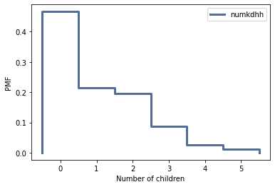
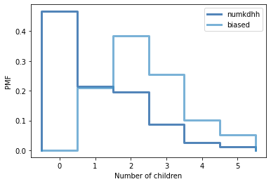

[Think Stats Chapter 3 Exercise 1](http://greenteapress.com/thinkstats2/html/thinkstats2004.html#toc31) (actual vs. biased)

```python
%matplotlib inline

import numpy as np
import nsfg
import first
import thinkstats2
import thinkplot
```


```python
resp = nsfg.ReadFemResp()
```


```python
pmf = thinkstats2.Pmf(resp.numkdhh, label='numkdhh')
```


```python
thinkplot.Pmf(pmf)
thinkplot.Config(xlabel='Number of children', ylabel='PMF')
```


    

    


```python
def BiasPmf(pmf, label):
    new_pmf = pmf.Copy(label=label)

    for x, p in pmf.Items():
        new_pmf.Mult(x, x)
        
    new_pmf.Normalize()
    return new_pmf
```


```python
biased = BiasPmf(pmf, label='biased')
```


```python
thinkplot.PrePlot(2)
thinkplot.Pmfs([pmf, biased])
thinkplot.Config(xlabel='Number of children', ylabel='PMF')
```


    

    


```python
pmf.Mean()
```


    1.024205155043831


```python
biased.Mean()
```


    2.403679100664282
